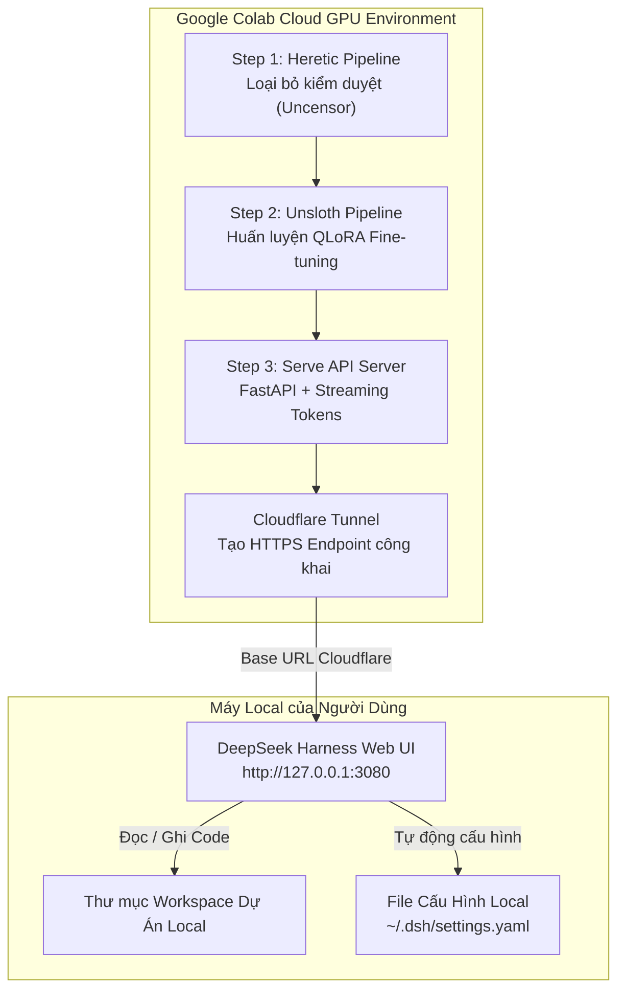

# 🚀 AI Coding Suite & DeepSeek Harness Ecosystem Overview

Tài liệu này mô tả tổng quan kiến trúc, nguồn tài nguyên tham khảo (Reference Sources), cây thư mục hệ thống và quy trình vận hành của **AI Coding Suite** kết hợp **DeepSeek Harness**, **Heretic**, **Unsloth** và **Google Colab GPU**.

---

## 🎯 Mục Tiêu Dự Án

Xây dựng hệ sinh thái **AI Coding riêng chủ (Self-hosted)** miễn phí, tốc độ cao, không kiểm duyệt (Uncensored) và tự động hóa 100%:
* **Chi phí 0 VNĐ**: Tận dụng GPU miễn phí/giá rẻ từ Google Colab (T4 / L4 / A100).
* **Giao diện chuẩn 100%**: Sử dụng giao diện **DeepSeek Harness Web UI** mở rộng từ DeepSeek AI.
* **Loại bỏ 100% kiểm duyệt (Uncensored)**: Sử dụng Heretic để triệt tiêu các câu trả lời từ chối (refusal) mà không làm suy giảm trí thông minh của mô hình.
* **Tự huấn luyện (Fine-tuning)**: Tinh chỉnh mô hình bằng dữ liệu code tùy chỉnh với Unsloth QLoRA siêu tốc.

---

## 🏗️ Sơ Đồ Kiến Trúc Hệ Thống (System Architecture)



---

## 📚 Danh Sách Các Nguồn Tham Khảo & Mã Nguồn Gốc (Reference Sources)

Dự án này được nghiên cứu, tích hợp và phát triển dựa trên các công nghệ hàng đầu thế giới trong cộng đồng Mã Nguồn Mở (Open Source AI):

### 1. 🖥️ DeepSeek Harness (`deepseek-ai/deepseek-harness`)
* **Loại công nghệ**: AI Agent Harness & Web Client Framework chính thức từ DeepSeek.
* **Vai trò trong dự án**: Cung cấp giao diện Web UI, quản lý Workspace, quản lý Chat Session và Agent Presets.
* **Link mã nguồn gốc**: [GitHub - deepseek-ai/deepseek-harness](https://github.com/deepseek-ai/deepseek-harness)

### 2. 🛡️ Heretic LLM (`heretic-llm`)
* **Loại công nghệ**: Công cụ bóc tách vectors kiểm duyệt (Activation Vector Surgery & Optuna Tuning).
* **Vai trò trong dự án**: Loại bỏ 100% censorship / refusal của mô hình trên GPU L4/A100 trước khi đem vào sử dụng.
* **Link tham khảo**: [PyPI - heretic-llm](https://pypi.org/project/heretic-llm/) | [GitHub - heretic](https://github.com/peterschmid/heretic)

### 3. 🦥 Unsloth AI (`unslothai/unsloth`)
* **Loại công nghệ**: Thư viện huấn luyện LLM tối ưu bằng Triton Kernels.
* **Vai trò trong dự án**: Tăng tốc độ fine-tune 2x - 5x, tiết kiệm 80% VRAM, hỗ trợ QLoRA 4-bit và tự động xuất ra merged 16-bit standalone model.
* **Link mã nguồn gốc**: [GitHub - unslothai/unsloth](https://github.com/unslothai/unsloth)

### 4. 🧠 Các Mô Hình Mã Nguồn Mở (Open Models from Hugging Face)
* **Qwen 2.5 Coder 7B Instruct**: Mô hình lập trình hàng đầu thế giới từ Alibaba Cloud. 
  - *Link HuggingFace*: [`Qwen/Qwen2.5-Coder-7B-Instruct`](https://huggingface.co/Qwen/Qwen2.5-Coder-7B-Instruct)
* **DeepSeek-R1 Distill Qwen 7B**: Mô hình suy luận tư duy (Reasoning Model) được chắt lọc từ DeepSeek-R1 vào kiến trúc Qwen.
  - *Link HuggingFace*: [`deepseek-ai/DeepSeek-R1-Distill-Qwen-7B`](https://huggingface.co/deepseek-ai/DeepSeek-R1-Distill-Qwen-7B)
* **DeepSeek-Coder-V2 Lite Instruct**: Mô hình kiến trúc MoE (Mixture-of-Experts) hỗ trợ 300+ ngôn ngữ lập trình và ngữ cảnh 128k.
  - *Link HuggingFace*: [`deepseek-ai/DeepSeek-Coder-V2-Lite-Instruct`](https://huggingface.co/deepseek-ai/DeepSeek-Coder-V2-Lite-Instruct)

### 5. 🌐 Cloudflare Tunnel (`cloudflared`)
* **Loại công nghệ**: Zero-Trust Ingress Tunnel của Cloudflare.
* **Vai trò trong dự án**: Tạo đường truyền kết nối bảo mật HTTPS từ máy chủ Colab ra ngoài Internet hoàn toàn miễn phí mà không cần mở Port modem.
* **Link tài liệu**: [Cloudflare Tunnel Documentation](https://developers.cloudflare.com/cloudflare-one/connections/connect-networks/)

### 6. ⚡ FastAPI & PyTorch Streaming Ecosystem
* **FastAPI + Uvicorn + BitsAndBytes**: Xây dựng backend server tương thích chuẩn OpenAI API RESTful (`/v1/models`, `/v1/chat/completions`) có hỗ trợ Server-Sent Events (SSE) cho Token Streaming.

---

## 🌳 Cây Thư Mục Tổng Thể (Workspace Directory Tree)

```text
Vietsub/ (Workspace Root)
│
├── 📂 ai-coding-suite/                # 🎯 TRỌNG TÂM: Bộ Notebook Colab, Script 1-Click & Launcher
│   ├── colab/                         # Bộ Notebook Colab chuyên dụng:
│   │   ├── 1_heretic_uncensor.ipynb   #   - Bước 1: Heretic Uncensoring Pipeline
│   │   ├── 2_unsloth_finetune.ipynb   #   - Bước 2: Unsloth QLoRA Fine-tuning Pipeline
│   │   ├── 3_serve_model.ipynb        #   - Bước 3: Master Serving API + Cloudflare Tunnel
│   │   ├── 3_serve_qwen_coder.ipynb   #   - 1-Click Serve Qwen 2.5 Coder 7B
│   │   ├── 3_serve_deepseek_r1.ipynb  #   - 1-Click Serve DeepSeek-R1 Distill 7B
│   │   ├── 3_serve_deepseek_coder_v2.ipynb # 1-Click Serve DeepSeek-Coder-V2 Lite 16B
│   │   └── shared/                    #   - Code FastAPI Server dùng chung (api_server.py)
│   ├── configure_dsh_settings.py      # Script nạp cấu hình Provider vào ~/.dsh/settings.yaml
│   ├── open_colab.bat                 # Script 1-Click mở đúng Colab Notebook theo model chọn
│   ├── start.bat                      # Script khởi chạy DeepSeek Harness Web UI (Port 3080)
│   └── PROJECT_OVERVIEW.md            # Tài liệu tổng quan hệ thống (File này)
│
├── 📂 deepseek-harness/               # 🖥️ DEEPSEEK HARNESS MONOREPO (Giao diện Web AI Agent)
│   ├── apps/web/                      # Web Client App (React / Vite)
│   ├── packages/client/               # UI Components (ModelSelect, ProviderEditor...)
│   └── packages/llm/                  # Plugin kết nối các Provider LLM
│
├── 📂 heretic/                        # 🛡️ HERETIC LLM FRAMEWORK (Mã nguồn công cụ Uncensor)
│   ├── src/                           # Mã nguồn Python của Heretic
│   └── pyproject.toml                 # Cấu hình gói Heretic
│
├── 📂 unsloth/                        # 🦥 UNSLOTH FINETUNING FRAMEWORK (Mã nguồn công cụ QLoRA)
│   ├── unsloth/                       # Core Triton Kernels & FastLanguageModel Engine
│   └── scripts/                       # Script hỗ trợ export GGUF & Merged 16-bit
│
├── 📂 .agents/                        # 🤖 AI AGENT SKILLS & KNOWLEDGE BASE
│   └── skills/vietsub-translator/     # Skill dịch thuật và xử lý phụ đề SRT tự động
│
├── 🎬 File Dữ Liệu Phụ Đề & Tool Xử Lý (Vietsub Tools):
│   ├── clean_repeats_0811.py          # Script Python làm sạch lặp từ trong file SRT
│   ├── SKILL_VIETSUB_GUIDELINES.md    # Quy chuẩn dịch thuật phụ đề Việt hóa
│   └── *.srt                           # Các file phụ đề SRT
│
└── ⚙️ Cấu hình Local người dùng (User Profile):
    └── C:\Users\Nguyen Trong Khoi\.dsh\settings.yaml # File cấu hình DeepSeek Harness kết nối Colab
```

---

## ⚡ Quy Trình Vận Hành 1-Click (Quick Start)

1. **Bật Web UI**: Chạy `ai-coding-suite/start.bat` $\rightarrow$ Mở `http://127.0.0.1:3080`.
2. **Mở Colab**: Chạy `ai-coding-suite/open_colab.bat` $\rightarrow$ Chọn số `1`, `2` hoặc `3`.
3. **Chạy Colab**: Bấm **Runtime → Run all** (`Ctrl + F9`) $\rightarrow$ Copy link `https://xxx.trycloudflare.com/v1`.
4. **Kết nối**: Dán link vào ô **`Base URL`** trong Settings của DeepSeek Harness và chọn model tương ứng.

---
*Tài liệu được cập nhật tự động vào 2026-08-17.*
