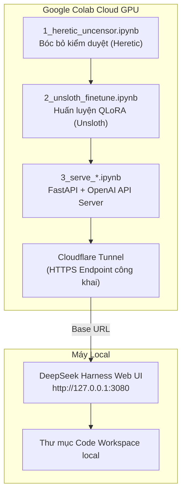

# 🚀 AI Coding Suite & DeepSeek Harness Colab Integration

Tài liệu này mô tả tổng quan kiến trúc, mục tiêu và cách vận hành dự án **AI Coding Suite** kết hợp **DeepSeek Harness** và **Google Colab GPU**.

---

## 🎯 Mục Tiêu Dự Án

Xây dựng hệ sinh thái **AI Coding riêng chủ (Self-hosted)** miễn phí, tốc độ cao, không kiểm duyệt (Uncensored) và tự động hóa 100%:
* **Không tốn chi phí API**: Tận dụng GPU miễn phí/giá rẻ từ Google Colab (T4 / L4 / A100).
* **Giao diện làm việc chuyên nghiệp**: Sử dụng giao diện **DeepSeek Harness Web UI** (chuẩn 100% của DeepSeek AI).
* **Bóc bỏ kiểm duyệt (Uncensored)**: Loại bỏ các rào cản refusal/censorship để AI hỗ trợ viết mọi loại code mà không bị từ chối.
* **Tự huấn luyện (Fine-tuning)**: Tự tinh chỉnh model bằng dữ liệu code tùy chỉnh với Unsloth QLoRA.

---

## 🏗️ Kiến Trúc Hệ Thống



---

## 🧠 Danh Sách 3 Model Coding Cốt Lõi

| Model | Vai trò | Đặc điểm |
|-------|---------|----------|
| **Qwen 2.5 Coder 7B Instruct** | Code Generator | Tạo mã nguồn siêu tốc, hiểu ngữ cảnh code sâu sắc |
| **DeepSeek-R1 Distill Qwen 7B** | Architect & Logic | Tư duy thuật toán, thiết kế kiến trúc hệ thống, suy luận logic |
| **DeepSeek-Coder-V2 Lite Instruct** | Reviewer & Security | Kiểm tra lỗi bảo mật, review code, hỗ trợ 300+ ngôn ngữ lập trình |

---

## 📂 Cấu Trúc Dự Án (`ai-coding-suite`)

```text
ai-coding-suite/
├── colab/                              # Bộ Notebook Colab
│   ├── 1_heretic_uncensor.ipynb        # Bước 1: Loại bỏ censorship với Heretic
│   ├── 2_unsloth_finetune.ipynb        # Bước 2: Fine-tune model với Unsloth
│   ├── 3_serve_model.ipynb             # Bước 3: Serve API OpenAI + Cloudflare (Master)
│   ├── 3_serve_qwen_coder.ipynb        # Serve 1-Click cho Qwen 2.5 Coder
│   ├── 3_serve_deepseek_r1.ipynb       # Serve 1-Click cho DeepSeek-R1 Distill
│   ├── 3_serve_deepseek_coder_v2.ipynb # Serve 1-Click cho DeepSeek-Coder-V2 Lite
│   └── shared/                         # Code dùng chung (FastAPI backend server)
├── configure_dsh_settings.py           # Script tự động nạp cấu hình vào ~/.dsh/settings.yaml
├── open_colab.bat                      # Script 1-Click mở đúng Colab Notebook theo model chọn
├── start.bat                           # Script khởi chạy DeepSeek Harness Web UI trên port 3080
└── PROJECT_OVERVIEW.md                 # File mô tả dự án này
```

---

## ⚡ Quy Trình Vận Hành (Quick Start)

### 1️⃣ Khởi chạy Giao diện DeepSeek Harness (Máy Local)
Nhấp đúp chuột vào file **`start.bat`**. Trình duyệt sẽ tự động mở giao diện tại:
👉 `http://127.0.0.1:3080`

### 2️⃣ Mở Colab Server cho Model mong muốn
Nhấp đúp chuột vào file **`open_colab.bat`** và chọn số tương ứng:
- `1` → Qwen 2.5 Coder 7B
- `2` → DeepSeek-R1 Distill 7B
- `3` → DeepSeek-Coder-V2 Lite 16B

### 3️⃣ Chạy Server trên Colab
Trên trang Colab vừa mở, chọn **Runtime → Run all** (`Ctrl + F9`). Sau khoảng 1-2 phút, Colab sẽ in ra đường link:
👉 `https://xxx.trycloudflare.com/v1`

### 4️⃣ Kết nối & Bắt đầu Lập trình
Copy link Cloudflare trên, mở **Settings ⚙️** trên DeepSeek Harness, dán vào ô **`Base URL`** và nhấn **`Apply`**. Bây giờ bạn đã có một AI Agent lập trình riêng với sức mạnh của GPU Colab!

---

## 📌 Các Tính Năng Đã Hoàn Thành
- [x] Tạo pipeline 3 bước Colab (Heretic → Unsloth → Serve).
- [x] Tối ưu Server tương thích 100% chuẩn OpenAI API (`/v1/chat/completions` + Streaming token).
- [x] Cấu hình sẵn Provider & Header nội bộ tự động (không bắt buộc nhập API key).
- [x] Tạo công cụ 1-Click Mở Colab & Launcher tự động.
- [x] Dọn dẹp hệ thống & khắc phục lỗi updater ngầm trên máy local.

---
*Tài liệu được cập nhật tự động vào 2026-08-17.*
